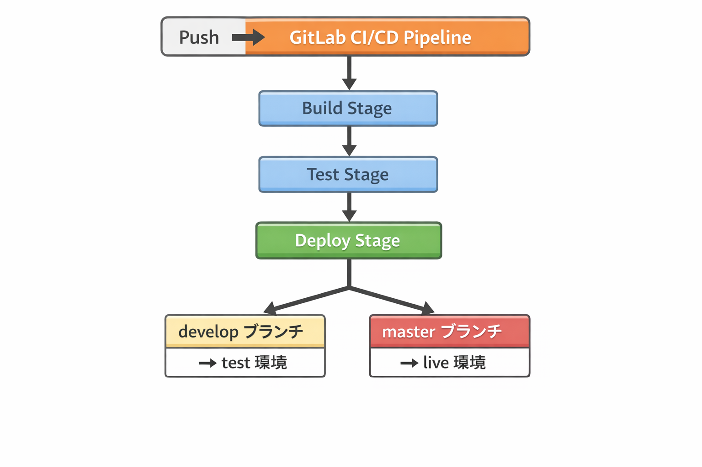

## 概要
Docker を使った local 環境（live/test）のサンプルです。  
GitLab CI/CD を想定した構成になっています。

## ディレクトリ構成

live-test_server/
├─ live/       ← 本番環境
├─ test/       ← テスト環境
├─ runner/     ← GitLab Runner 設定（非公開）
└─ certs/      ← SSL 証明書（非公開）

## 環境構築手順

1. Docker Desktop をインストール

2. リポジトリをクローン

3. test 環境を起動
```bash
cd test
docker compose up -d
```

4.live 環境を起動
```bash
cd ../live
docker compose up -d
```

## CI/CDの流れ

Push → GitLab CI/CD Pipeline
↓
Build Stage → Test Stage → Deploy Stage
(developブランチ: test環境, masterブランチ: live環境)


